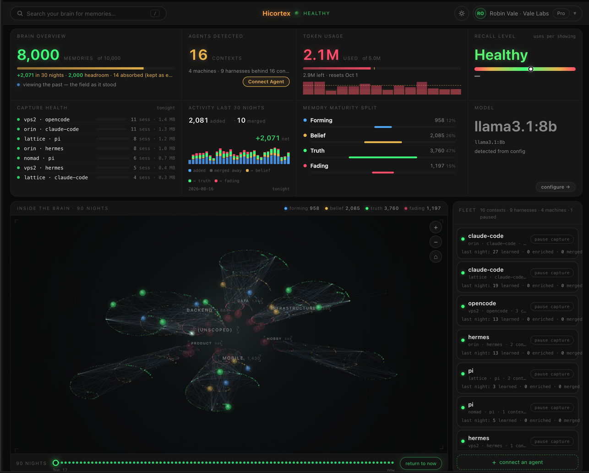

# Hicortex



[](https://www.npmjs.com/package/@gamaze/hicortex)
[](https://www.npmjs.com/package/@gamaze/hicortex)
[](LICENSE)
[](https://nodejs.org)

**Memory that shows up before your agent asks.** One memory across every agent, every project, every machine — they stop assuming and start knowing.

- **One brain, every harness** — Claude Code, Hermes, OpenClaw, Pi, and any MCP-compatible agent share the same memory.
- **Pushed, not pulled** — a compact recall index is injected on *every prompt*, so the decisions, corrections, and context an agent needs are already in front of it. No re-explaining, no copy-paste, nothing to maintain. **Zero LLM calls per turn** — no API cost or rate-limit hit from recall.
- **Consolidates overnight** — each night it reads the day's sessions, distills what matters, and turns it into lessons, links, and a knowledge graph.
- **Local-first** — raw sessions never leave the machine; only distilled memory is stored.

## Install

```bash
npx @gamaze/hicortex init
```

Auto-detects your environment, configures one LLM (Ollama, the Claude CLI, or an API key), installs a local daemon (launchd on macOS, systemd on Linux), and registers MCP tools with Claude Code.

For multi-machine setups, point thin clients at a shared server — no local DB or LLM on the clients:

```bash
npx @gamaze/hicortex init --server https://your-server.example.com
```

Pi connects via [pi-mcp-adapter](https://github.com/nicobailon/pi-mcp-adapter); Hermes and OpenClaw via their plugins. See the [install docs](https://hicortex.gamaze.com/docs/installation).

## How it works

```
CAPTURE (nightly)        CONSOLIDATE (nightly)             RECALL (every prompt)
sessions → denoise       score · reflect · link            a compact index of
→ POST /distill          decay · dedup · supersede         relevant memories is
                         (one model, all phases)           pushed into the prompt
                                                           → full text lazy-loaded
```

Memories strengthen when agents use them, fade when they don't, and link to related ones automatically. Retrieval is hybrid BM25 + vector search — zero-LLM at query time.

## Features

- **Per-prompt recall push** — relevant memory lands in context every turn; the agent fetches full content with `hicortex_get` only when it needs it.
- **Memory analytics** at `/dashboard` — growth, recall adoption, and a nightly digest of what was learned.
- **Knowledge graph** at `/viz` — memories clustered by domain, connected by relationship edges.
- **Domains & tags** — multi-tag classification with a configurable vocabulary; your categories drift with your data.
- **Lessons from reflection** — nightly reflection extracts general, reusable lessons, not just episode logs.
- **Dedup & supersession** — near-duplicates merged; stale decisions and corrections superseded, not re-surfaced.
- **Standing context layer** — hand-edited "who you are / how to work" Markdown, injected every session, never decayed.

## MCP

Nine MCP tools — `hicortex_search`, `hicortex_get`, `hicortex_recent`, `hicortex_ingest`, `hicortex_lessons`, `hicortex_index`, `hicortex_graph`, `hicortex_update`, `hicortex_delete` — plus a `/learn` skill to save explicit learnings. [Full reference →](https://hicortex.gamaze.com/docs/)

## Stack

TypeScript · Node.js 20+ · SQLite + sqlite-vec + FTS5 (semantic + full-text in one DB) · ONNX embeddings (bge-small-en, CPU) · MCP over HTTP/SSE · one configurable LLM (Ollama, Claude CLI, or any OpenAI-compatible endpoint).

## Development

```bash
git clone https://github.com/gamaze-labs/hicortex.git
cd hicortex/packages/hicortex
npm install && npm run build && npm test
```

Contributions welcome — see [CONTRIBUTING.md](CONTRIBUTING.md).

## Links

- **Website:** [hicortex.gamaze.com](https://hicortex.gamaze.com)
- **Docs:** [hicortex.gamaze.com/docs](https://hicortex.gamaze.com/docs/)
- **Changelog:** [CHANGELOG.md](CHANGELOG.md)
- **npm:** [@gamaze/hicortex](https://www.npmjs.com/package/@gamaze/hicortex)
- **Issues:** [gamaze-labs/hicortex/issues](https://github.com/gamaze-labs/hicortex/issues)
- **Security:** [SECURITY.md](SECURITY.md)

## License

Personal and noncommercial use is free under the [PolyForm Noncommercial License 1.0.0](LICENSE). Commercial use requires a per-seat license — see [hicortex.gamaze.com](https://hicortex.gamaze.com).
